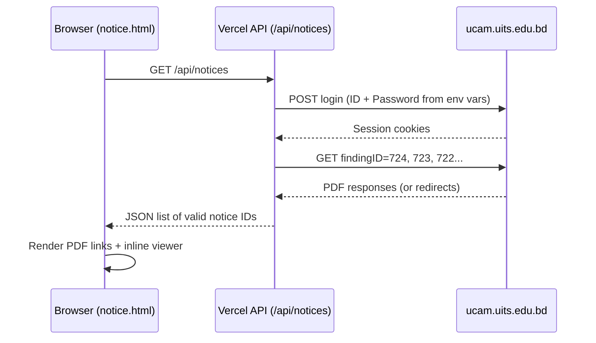

# Chat Conversation

Note: _This is purely the output of the chat conversation and does not contain any raw data, codebase snippets, etc. used to generate the output._

### User Input

#target: in this page, I want to implements a notice scrapper of sorts

#specification:
- the target website does not allow viewing notice without logging in first. So I want to use my student ID and Password to log in and then list the PDF links to those notices in this webpage.
- this is an example link: https://ucam.uits.edu.bd/Notice/MainNoticePage.aspx?findingID=723
- the scrapper should be able to check if ID=724 (PDF serial) is returning a PDF file or not. If yes, then the top-most link in the list will be of ID=724 (or, https://ucam.uits.edu.bd/Notice/MainNoticePage.aspx?findingID=724)
- there needs to be a simple pdf renderer with download button within my website as well

#concerns:
- I do not wish to reveal my ID or Password in any form to the forntend clients. Therefore, I am thinking of opting into a backend hosting.
- what web hosting will be best for this implementation? Vercel or Cloudfare? 
- should I use a separate repository to host my backend codes? again, I do not want to reveal my credentials

#instruction:
- do not proceed to generate the code. Let me decide first

### Planner Response

Let me first take a quick look at your project structure and the target page to give you well-informed advice.

*Listed directory [b1t-Acad](file:///e:/Git_WIP/3.%20University%20repositories/b1t-Acad) *

*Viewed [index.html](file:///e:/Git_WIP/3.%20University%20repositories/b1t-Acad/index.html) *

*Read URL content from /Notice/MainNoticePage.aspx *

### Planner Response

Now let me check the existing [misc/notice.html](cci:7://file:///e:/Git_WIP/3.%20University%20repositories/b1t-Acad/misc/notice.html:0:0-0:0) page since it's already linked in the nav:

*Viewed [notice.html](file:///e:/Git_WIP/3.%20University%20repositories/b1t-Acad/misc/notice.html) *

### Planner Response

Good — I now have a clear picture. Your current `b1t-Acad` project is a **static site hosted on Netlify**, and you already have a [misc/notice.html](cci:7://file:///e:/Git_WIP/3.%20University%20repositories/b1t-Acad/misc/notice.html:0:0-0:0) page that currently just embeds an iframe of the public `uits.edu.bd/notice` page. The UCAM portal (where the PDFs are) **requires login** and redirects unauthenticated requests.

Here's my analysis and recommendations on your concerns:

---

## Architecture Overview

You need two pieces:

1. **Backend (Serverless Function)** — Logs into UCAM with your credentials, checks `findingID` values, and returns a list of valid PDF URLs.
2. **Frontend (on [misc/notice.html](cci:7://file:///e:/Git_WIP/3.%20University%20repositories/b1t-Acad/misc/notice.html:0:0-0:0))** — Calls your backend API, displays the notice list, and renders PDFs inline with a download button.

---

## 🔒 Credential Security

Your instinct is correct — **credentials must never touch the frontend**. Here's the approach:

- Store your **Student ID and Password** as **environment variables** (secrets) on your backend hosting provider.
- The serverless function reads them at runtime. They are **never committed to code** and **never sent to the browser**.
- The frontend only calls your API endpoint (e.g., `GET /api/notices`) and receives back a JSON list of valid notice IDs/URLs.

---

## ☁️ Vercel vs Cloudflare — Which to Use?

| Factor | **Vercel** | **Cloudflare Workers** |
|---|---|---|
| **Ease of setup** | ✅ Very easy with Next.js API routes or standalone serverless functions | Moderate — uses its own runtime (not full Node.js) |
| **Node.js support** | ✅ Full Node.js (can use `puppeteer`, `axios`, cookies easily) | ⚠️ Limited — Workers use a V8 isolate, not full Node.js. No native `puppeteer`. |
| **Web scraping** | ✅ Can use `puppeteer` or session-based `fetch` with cookies | ⚠️ Harder — would need Cloudflare Browser Rendering (paid add-on) |
| **Secrets management** | ✅ Built-in environment variables | ✅ Built-in secrets/environment variables |
| **Free tier** | ✅ Generous (100GB bandwidth, serverless function invocations) | ✅ Generous (100K requests/day) |
| **Cold start** | Moderate (~250ms) | ✅ Very fast (~0ms) |

### **My Recommendation: Vercel**

The UCAM portal is an **ASP.NET WebForms** application (uses `__VIEWSTATE`, form POST for login). Scraping it will likely require:
- Maintaining a **session/cookies** after login
- Posting form data with hidden fields like `__VIEWSTATE`
- Possibly handling redirects

This is much easier with **full Node.js** (Vercel) than with Cloudflare Workers' limited runtime. You can use libraries like `axios` + `tough-cookie` or even `puppeteer` if needed.

---

## 📁 Separate Repository?

**Yes, absolutely use a separate private repository** for the backend. Here's why:

1. **`b1t-Acad` is a public repo** (hosted on Netlify as a static site). Any backend code here would be visible to everyone.
2. Even though credentials are stored as env vars, the **scraping logic itself** (login flow, endpoints, form field names) is best kept private to avoid abuse of the UCAM portal.
3. The Vercel project would deploy from this private repo, and your frontend on Netlify just calls the Vercel API URL.

### Suggested structure:
```
b1t-Acad/                    (public, Netlify — static frontend)
├── misc/notice.html         ← PDF viewer + notice list UI

b1t-acad-backend/            (private, Vercel — serverless API)
├── api/
│   └── notices.js           ← Serverless function: login → scrape → return PDFs
├── package.json
└── vercel.json
```

---

## 📋 How It Would Work (High-Level Flow)



---

## Questions Before I Proceed

1. **Vercel sounds good?** Or do you have a preference for another platform?
2. **Separate private repo** — do you want me to help you set up the project structure for it, or will you create the repo yourself?
3. **How many notice IDs** should the scraper check? Should it scan backward from the latest known ID (e.g., try 724, 723, 722... down to some minimum), or do you have a specific range in mind?
4. Do you want the **PDF to be proxied through your backend** as well (so users don't need UCAM login to view it), or just link to the UCAM URL?

*Edited relevant file*

*Edited relevant file*

### User Input

1. I am good with using Vercel. Please provide ample explanations thorughout the process
2. yes! create a backend folder that I will be moving into a new repository folder later. add project plans in the folder so the agent can understand and continue from where I left (continue working in a new repository)
3. The scrapper should check first 15 notice IDs backward from the latest known ID. The latest known ID will be updated (increment by one whena PDF is found. It means that there nust be a "no PDF page" in the next serial no. When there is not PDF available the server shows an empty page with just the header and footer. Footer says: "Powered by Edusoft Consultants Ltd
Copyright © 2016 - 2026 Edusoft Consultants Ltd. All rights reserved."
4. yes. I want the whole thing to be run without user inconvenience

### Planner Response

Let me look at the login page structure to understand the scraping requirements, then check for any existing tests:

*Read URL content from /Security/LogIn.aspx *

*Listed directory [misc](file:///e:/Git_WIP/3.%20University%20repositories/b1t-Acad/misc) *

### Planner Response

The login page uses a simple form. Now let me try to see the HTML source of the login page more fully to understand the form fields:

### Planner Response

Browser isn't available, but I have enough information from the page source and my knowledge of ASP.NET WebForms login pages. Let me now create the task file and implementation plan:

*Edited relevant file*

*Edited relevant file*

### User Input


*Edited relevant file*

*Edited relevant file*

*Edited relevant file*

*Edited relevant file*

### Planner Response

Now let me create the core shared library and both API endpoints:

*Edited relevant file*

### Planner Response

Now let me create both API endpoints:

*Edited relevant file*

*Edited relevant file*

### Planner Response

Now let me create the `PROJECT_PLAN.md` handoff document and then update the frontend:

*Edited relevant file*

### Planner Response

Now let me build the frontend — the redesigned [misc/notice.html](cci:7://file:///e:/Git_WIP/3.%20University%20repositories/b1t-Acad/misc/notice.html:0:0-0:0):

*Edited relevant file*

### Planner Response

Now let me install dependencies and update the task checklist:

*User accepted the command `npm install`*

*Edited relevant file*

### Planner Response

The npm install failed due to PowerShell execution policies. Let me retry with cmd:

*User accepted the command `cmd /c npm install`*

### Planner Response

Dependencies installed successfully. Now let me create the walkthrough:

*Edited relevant file*